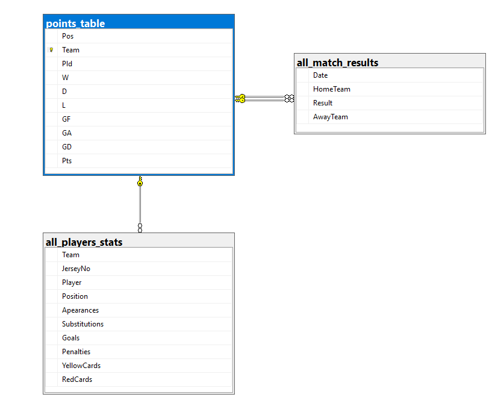

# English Premier League (EPL) Data Warehouse & Automated ETL Pipeline

## Motivation & Project Overview
The English Premier League (EPL) 2021–2022 dataset contains rich information about matches, teams, and players, but this raw transactional data is not organized in a way that supports analytical queries. Running performance analytics directly on an operational database would be slow, repetitive, and difficult because:

* Player statistics, match results, and team information exist in separate tables, not optimized for analytical joins.
* Historical player updates (such as transfers or position changes) cannot be tracked reliably without a dimensional model.
* Many analytical questions require complex aggregations across time, teams, and stadiums—something OLTP systems are not designed to handle efficiently.

To make this data suitable for analytical decision-making, this project implements a dimensional model to efficiently query historical match data alongside evolving player statistics.
---

## Questions and Challenges Addressed
This Data Warehouse was specifically architected to answer the following analytical challenges:

**Team Questions:**
* Is a team performing better away or at home? 
  * Manchester City for example has 58 home goals vs 41 away goals, showing a clear home advantage.
* What are a team's weak points?
* Is a team performing better at the start of the season or at its end?
  * A team like Arsenal shows his peak performance in the middle of the season (December) while through the begining and end of the season shows average performance signs.

**Player Questions:**
* Who is the best player in each position?
  * Mohamed Salah ranked as the best attacking player, leading in total goals with the highest GoalsPerAppearance ratio — only Riyad Mahrez edges him out in efficiency..
* Which players should be suggested for sale based on performance analysis?
* Who should be nominated as the player of the season?

**Stadium Questions:**
* What is the number of goals scored in each stadium?
  * Queries Show Etihad Stadium as the stadium that has seen most goals which makes sense, since Manchester City is the best attacking team based on the numbers we have.

---

## Architecture & Schema Design
The data warehouse is built using a **Star Schema** architecture, heavily denormalized to optimize read performance for analytical queries. 

### Dimension Tables
* **`Player_dim`**: Tracks player details, implementing **Slowly Changing Dimensions (SCD) Type 6** to maintain strict historical accuracy. It uses `CurrTeam`/`PrevTeam` and `CurrPos`/`PrevPos` (Type 3), `Valid_from`/`Valid_to` and a `Flag` (Type 2), and overwrites standard attributes (Type 1) to track positional and team transfers over time.
* **`Team_dim` & `Stadium_dim`**: Stores static details about the EPL teams and their respective home stadiums.
* **`Pos_dim`**: Stores the roles/positions players hold on the field.
* **`Date_dim`**: A standard time dimension breaking down match dates into Year, Month, and Day hierarchies.

### Fact Tables
* **`MatchFact`**: A transactional fact table recording the results of individual games, linking to the Date, Team, and Stadium dimensions.
* **`PlayerFact`**: An aggregated fact table tracking cumulative player statistics and calculating key performance indicators (KPIs) such as `GoalsPerApearance` and `PenaltiesRatio`.

---

## Key Engineering Features
To mimic real-world enterprise environments, this pipeline moves beyond standard `TRUNCATE` and `LOAD` operations, focusing on incremental efficiency and automation:

1. **Separation of Concerns:** The ETL process is strictly separated into a one-time static load script (`Static Data Warehouse ETLs.sql`) and an idempotent daily delta load script (`PlayerDim + Fact Tables ETLs.sql`).
2. **SCD Type 6 Implementation:** The `Load_PlayerDim` stored procedure dynamically detects changes in player profiles, utilizing in-memory Temporary Tables (`#ChangedPlayers`) to efficiently process complex Type 2 and Type 3 updates without redundant querying.
3. **Incremental UPSERTs (`MERGE`):** The `PlayerFact` table abandons brute-force recalculations in favor of optimized T-SQL `MERGE` operations, updating existing player totals when matched and inserting new rows only when necessary.
4. **Delta Loads:** The `MatchFact` load utilizes `WHERE NOT EXISTS` filtering paired with declared dynamic variables to safely append only new daily matches, preventing data duplication.
5. **Fully Automated Scheduling:** The daily ETL pipeline is orchestrated using **SQL Server Agent Jobs**, scheduled to run automatically at midnight.
6. **Automated Alerting:** Integrated `sp_send_dbmail` within a `TRY...CATCH` block automatically notifies database administrators via email upon job success or failure.

---

## Business Intelligence & Reporting
To demonstrate the analytical capabilities of the Star Schema, I developed an interactive Power BI dashboard. This dashboard connects directly to the SQL Server Data Warehouse to visualize the 2021-22 EPL season metrics.

### Key Dashboard Features:
* **Performance Tracking**: A "Home vs. Away" comparison using DAX Userelationship functions to handle role-playing team dimensions.
* **Player Leaderboards**: A dynamic matrix identifying top performers by position based on goals and efficiency metrics.
* **Trend Analysis**: A monthly goal-scoring trend line chart that identifies team momentum throughout the season.
* **Interactive UI**: A dark-themed, high-contrast interface with centralized slicers for real-time data filtering by team and stadium.

---

## Repository Structure
* `/Data/`
  * `all_match_results.csv`, `all_players_stats.csv`, `points_table.csv` - Raw source datasets.
* `/SQL Scripts/`
  * `Database Stage Tables.sql` - Creates the initial OLTP database and staging tables.
  * `CSV Daily Load Procedure.sql` - BULK INSERT logic for raw CSV data and initial `sp_send_dbmail` configuration.
  * `Data warehouse create statements.sql` - DDL scripts defining the Star Schema architecture (Facts and Dimensions).
  * `Static Data Warehouse ETLs.sql` - Initial static dimension loads and setup.
  * `PlayerDim + Fact Tables ETLs.sql` - The daily automated ETL script containing the SCD Type 6 procedure, MERGE statements, and job logic.
  * `Analytical Queries.sql` - Answering some of the analytical questions I built this DWH around.
* `/Dashboards/` - Power BI Dashboard.
* `Project Requirements.pdf` - Original project requirements.
* `/Images/` - Architecture diagrams, Dashboards and execution proof.

---

## How to Run
1. Restore or create the staging DB using `Database Stage Tables.sql`
2. Configure BULK INSERT paths and `sp_send_dbmail` in `CSV Daily Load Procedure.sql`
3. Run `Data warehouse create statements.sql` to build the Star Schema
4. Execute `Static Data Warehouse ETLs.sql` once for initial dimension loads
5. Schedule `PlayerDim + Fact Tables ETLs.sql` via SQL Server Agent (runs daily at 9:00PM)
6. Open `/Dashboards/` in Power BI Desktop and point to your SQL Server instance

---

## Proof of Execution
The SQL Server Agent job ran successfully on schedule, with email alerts delivered 
confirming both the CSV staging load and the nightly ETL completion.

